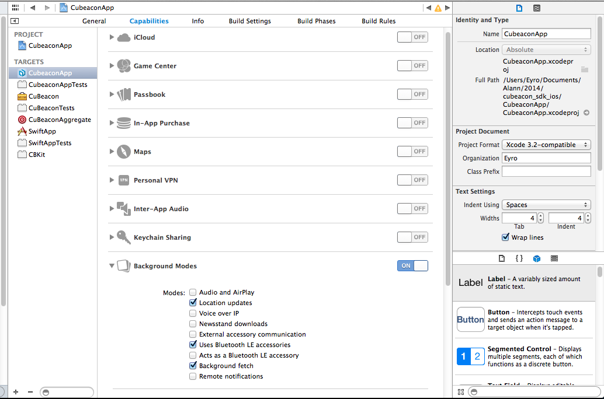

# Cubeacon Sample iOS Project #

This repository is reserved for iOS Cubeacon SDK Demos app.

## Cubeacon SDK Overview ##
Cubeacon SDK for iOS is a library to allow interaction with any iBeacons. The SDK system requirements are iOS 7 or above and Bluetooth Low Energy. 

**Cubeacon SDK allows for :**

- Integrating with Cubeacon SaaS
- Scanning any beacons on a foreground UI or on background as a service
- Showing alert (foreground) or notifications (background) when any beacons entered region `setDidEnterBlock` and exited region `setDidExitBlock`
- Showing alert (foreground) when any beacons detected with immediate proximity `setImmediateBlock`, near proximity `setNearBlock` and far proxmity `setFarBlock`
- Showing scenario based on beacons detected using storylines
- Sending realtime analytic to Cubeacon SaaS

**Cubeacon Link :**

- [Cubeacon Software as a Service][CubeaconSaaS]
- [iOS Apple Documentation][AppleDoc]
- [Provide us Comments][Issue]

## Cubeacon SDK Installation ##
1. Download the Cubeacon SDK framework from [Cubeacon Developer][CubeaconSaaS].
2. Ensure the following frameworks and a library exist in your project :
   - `libsqlite3.0.dylib`
   - `UIKit.framework`
   - `Foundation.framework`
   - `CoreLocation.framework`
   - `CoreFoundation.framework`
   - `CoreGraphics.framework`
3. Extract `CubeaconSDK-iOS-xxx.zip`, drag in `Cubeacon.plist` to Xcode project.
4. Then drag in `CBKit.framework` into the `Frameworks` section in your XCode project.
5. Create a PCH file and add the folowing code :

    ```ios
    #import <Availability.h>

    #ifndef __IPHONE_5_0
        #warning "This project uses features only available in iOS SDK 5.0 and later."
    #endif
    
    #ifdef __OBJC__
        #import <UIKit/UIKit.h>
        #import <Foundation/Foundation.h>
        #import <CBKit/CBKit.h>
    #endif
    ```
    Then, don't forget to setting up the PCH file to `Build Settings` below `Apple LLVM 6.1 - Language` :
    - set `Precompile Prefix Header` to `Yes`
    - set `Prefix Header` to `<project-name>/<pch-filename.pch>`
6. Add the following code to initialize Cubeacon SDK in `AppDelegate` `application:didFinishLaunchingWithOptions` method :

    ```ios
    - (BOOL)application:(UIApplication *)application didFinishLaunchingWithOptions:(NSDictionary *)launchOptions
    {
        // enable Cubeacon SDK to show notification
        UIUserNotificationSettings *setting = [UIUserNotificationSettings settingsForTypes:UIUserNotificationTypeAlert categories:[NSSet setWithObject:@"BeaconsNotification"]];
        [application registerUserNotificationSettings:setting];
        
        // init Cubeacon SDK with plist file
        NSString *plistPath = [[NSBundle mainBundle] pathForResource:@"Cubeacon" ofType:@"plist"];
        [CBApp setupWithPlist:plistPath];
        
        // enable this line below to enable Cubeacon SDK Debug Loggin
        [CBApp enableDebugLogging];
        
        // download beacon data
        [[CBApp getInstance] refreshBeacons];
        
        return YES;
    }
    ```
7. Open your project settings and go to the `Capabilities` tab. Setting like this screenshot below :

    
8. Add this two lines into `info.plist` file :

| Key                                   | Type   | Value                                                 |
|---------------------------------------|--------|-------------------------------------------------------|
| `NSLocationAlwaysUsageDescription`    | String | CuBeacon use location service to scan near by beacons |
| `NSLocationWhenInUseUsageDescription` | String | CuBeacon use location service to scan near by beacons |

## Usage and Demos ##
You can import `Cubeacon SDK Demos` that located in this repo to your XCode project. 

Then, on `ViewController` of your apps :

```ios
    - (void)viewDidLoad
    {
        [super viewDidLoad];
        [[CBApp getInstance] setDidEnterBlock:^(CBBeacon* beacon){
            // do something when beacon entered region, ex: change background color
        }];
        
        [[CBApp getInstance] setDidExitBlock:^(CBBeacon* beacon, NSTimeInterval interval){
            // do something when beacon exited from region, ex: change background color
        }];
        
        [[CBApp getInstance] setDidChangeNearestBlock:^(CBBeacon* old, CBBeacon* current){
            // do something when nearest beacon changed
            if (current.storyline == kStorylineImage) {
                // display a brochure image
            } else if (current.storyline == kStorylineText) {
                // show text alert/notification
            } else if (current.storyline == kStorylineHtml) {
                // show html page via uiwebview
            } else if (current.storyline == kStorylineUrl) {
                // open url in a uiwebview/safari browser
            } else if (current.storyline == kStorylineVideo) {
                // play a video streaming
            }
        }];
        
        [[CBApp getInstance] setDidUpdateRange:^(double range){
            // show and update distance of a nearest beacon
        }];
        
        [[CBApp getInstance] setDidEmptyBlock:^(){
            // do something when no beacon arround detected
        }];
        
        /* This line block below is activated when using new storyline mode */
        [[CBApp getInstance] setDidImmediateBlock:^(CBBeacon* beacon){
        if (beacon.cbStoryline.campaign == CBCampaignTypeImage) {
            // display a brochure image
        } else if (beacon.cbStoryline.campaign == CBCampaignTypeHtml) {
            // show html page via uiwebview
        } else if (beacon.cbStoryline.campaign == CBCampaignTypeUrl) {
            // open url in a uiwebview/safari browser
        } else if (beacon.cbStoryline.campaign == CBCampaignTypeVideo) {
            // play a video streaming
        }
    }];
    
    [[CBApp getInstance] setDidNearBlock:^(CBBeacon* beacon){
        if (beacon.cbStoryline.campaign == CBCampaignTypeImage) {
            // display a brochure image
        } else if (beacon.cbStoryline.campaign == CBCampaignTypeHtml) {
            // show html page via uiwebview
        } else if (beacon.cbStoryline.campaign == CBCampaignTypeUrl) {
            // open url in a uiwebview/safari browser
        } else if (beacon.cbStoryline.campaign == CBCampaignTypeVideo) {
            // play a video streaming
        }
    }];
    
    [[CBApp getInstance] setDidFarBlock:^(CBBeacon* beacon){
        if (beacon.cbStoryline.campaign == CBCampaignTypeImage) {
            // display a brochure image
        } else if (beacon.cbStoryline.campaign == CBCampaignTypeHtml) {
            // show html page via uiwebview
        } else if (beacon.cbStoryline.campaign == CBCampaignTypeUrl) {
            // open url in a uiwebview/safari browser
        } else if (beacon.cbStoryline.campaign == CBCampaignTypeVideo) {
            // play a video streaming
        }
    }];
    }
```

### Meta Users ###
By improving analytics usage and user engagement, Cubeacon SDK enhanced with `Meta User` module. This module is optional. So if you want to get user informations like `fullname` and `email`, show a form with 2 textinput and you can save into cloud like this :

```ios
    [[CBUser currentUser] setUserDisplayName:@"User display name" andUserEmail:@"username@email.com"];
    [[CBUser currentUser] saveUserData:^(BOOL success, NSString *errorMessages) {
        if (success) {
            NSLog(@"Save meta user succeed...");
        } else {
            NSLog(@"Save meta user failed: %@", errorMessages);
        }
    }];
```

## Changelog ##
* 1.3.2 (April, 29, 2015)
  - Fix optional parameter when downloading data from cloud
* 1.3.1 (March 19, 2015)
  - Add support `#user` on `UILocalnotification`.
  - Add method to enable debug logging from Cubeacon SDK
* 1.3.0 (February 21, 2015)
  - New storyline with custom campaign like showing Image, Video, Url web page and HTML formatted content.
  - New analytic data based new storyline
  - Comply with current Cubeacon SaaS v1.3.0
* 1.2.0 (January 28, 2015)
  - Add meta user for analytics
  - Add storyline for beacon scenario
  - Comply with current Cubeacon SaaS v1.2.0
* 1.0.0 (November 10, 2014)
  - Improve stability
  - Comply with current Cubeacon SaaS v1.0.0
  - Compatible with iOS 8
* 0.5.0 (August 25, 2014)
  - Initial release

[CubeaconSaaS]:http://developer.cubeacon.com
[AppleDoc]:http://docs.cubeacon.com/sdk/ios/references/index.html
[Issue]:https://github.com/cubeacon/ios-cubeacon-sample/issues
[KiiCloud]:http://docs.cubeacon.com/saas/signup-kii/